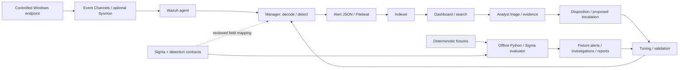

# Detection Engineering Lab

Five Windows detections with an executable **offline detection → alert → triage → disposition → tuning → validation** workflow. Built for an evidence-based SOC / Detection Engineering interview: inspect a rule, reproduce its result, and explain what the evidence cannot establish.

**Current evidence:** deterministic fixtures and simulated analyst decisions. **Live evidence: none.** The optional Wazuh 4.14.7 setup is documented and version-pinned; its deployment, agent enrollment, decoder behavior and end-to-end alerts have not been demonstrated here.



The upper path is **optional and unverified live**. The lower path runs now without Wazuh. Manager detection precedes alert indexing; dashboard searches support investigation. Sigma is source logic and metadata, not a Wazuh-native rule format.

## Run the interview demo

Python 3.11–3.14; CI covers 3.11 and 3.14 on Windows and Ubuntu. Initial dependency installation needs internet. Subsequent demo runs make no network requests and require no credentials, `make`, administrator access or SIEM.

```powershell
git clone https://github.com/farhan-shafee/detection-engineering-lab.git
cd detection-engineering-lab
python -m venv .venv
.\.venv\Scripts\python.exe -m pip install -r requirements-dev.txt
.\demo\run-demo.ps1
```

In an activated Python environment, the memorable command is:

```text
python -m detection_lab demo
```

On Linux/macOS, activate with `source .venv/bin/activate`, then install the same requirements and run that command. The Windows wrapper locates `.venv` automatically and works from another directory. It does not change execution policy; if local script policy prevents running it, invoke the virtual environment's Python directly.

The demo validates contracts, parses Sigma, evaluates every fixture, verifies evidence hashes, builds a fixture alert queue, links worked investigations and computes before/after tuning. It writes [reports/demo.md](reports/demo.md) and [reports/demo.json](reports/demo.json). `python -m detection_lab demo --check` compares these reviewed outputs without writing. A match is an alert candidate, never an automatic incident.

## Five flagship detections

| ID | Behavior / exact telemetry | ATT&CK association | Implementation |
|---|---|---|---|
| DET-001 | Encoded PowerShell; Sysmon 1 | T1059.001, execution | Sigma predicates + scoped automation tuning; Wazuh initial-signal candidate |
| DET-002 | Addition to local Administrators; Security 4732, group SID | T1098.007, persistence / privilege escalation | Membership only: does **not** establish account creation |
| DET-003 | Five failures then success within 300 seconds; Security 4625 → 4624 | T1110, credential access hypothesis | Python temporal correlation; two Sigma component selectors, Wazuh mapping only |
| DET-004 | Task registration containing encoded PowerShell action; Security 4698 | T1053.005, execution | Registration signal; does **not** establish execution or persistence |
| DET-005 | Office parent spawning PowerShell; Sysmon 1 | T1059.001, execution | Process relationship; does **not** establish malicious document or user intent |

[Machine-readable catalog](detections/catalog.json) · [detection writeups](detections/detection_logic.md) · [fixtures](fixtures/) · [Sigma rules](sigma-rules/)

Each contract supplies owner, version, hypothesis, source requirements, technique rationale, severity, false positives, triage, escalation, tuning and limitations. All rules remain `experimental`. [Field mapping and Sigma limitations](docs/detection-model.md) explain why cross-SIEM parity is not claimed.

## Evidence and investigation

- [Generated report](reports/demo.md): computed fixture outcomes, alert/disposition counts, six worked investigations and tuning results.
- [Investigation sources](evidence/investigations/): record IDs, who/host/process/time, explicit unavailable fields, observations separate from inference, and proposed next actions.
- [Tuning history](evidence/tuning/): initial rule, an investigated automation case, narrowly modified rule and regression expectations.
- [Evidence manifest](evidence/fixtures/manifest.json): SHA-256 over canonical LF source files; detects drift, not proof of capture authenticity.
- [Live evidence status](evidence/live/README.md): zero live captures and a template for a future real run. No fabricated screenshots.
- [Original samples](logs/README.md): retained legacy synthetic examples, excluded from flagship coverage claims.

**REAL** means only an actually captured and reviewed source/agent/SIEM artifact. There are currently none. **DETERMINISTIC** describes fixture matching and report generation. **SIMULATED** describes owner statements, approvals, escalation and response decisions in the investigations; no real ticket or containment action occurs.

## Optional live telemetry

[Live lab setup](docs/live-lab.md) covers Docker Desktop/WSL2, a pinned upstream single-node stack, loopback ports, credentials, certificates, agent installation, event searches, persistence and reset. [Telemetry design](docs/telemetry.md) distinguishes existing channels from explicitly enabled audit events and optional Sysmon. Safe event generation is preview-only by default:

```powershell
.\demo\generate-safe-events.ps1
.\demo\verify-telemetry.ps1
```

Only the generator's explicit `-Execute` mode launches one child process that prints a fixed marker. It changes no accounts, tasks, policies or security controls. The other four use cases remain deterministic; the lab does not generate authentication failures, alter privileged memberships or automate Office.

## Validate and discuss

```text
python -m unittest discover -s tests -v
python -m ruff check .
python -m ruff format --check .
python -m detection_lab validate
python -m detection_lab demo --check
python scripts/security_check.py
python -m bandit -r detection_lab scripts
python -m pip_audit
```

Dependency auditing requires internet. [CI](https://github.com/farhan-shafee/detection-engineering-lab/actions/workflows/ci.yml) uses SHA-pinned actions, read-only permissions and no private secrets or live backend. [Validation record](docs/validation.md) states exact results and remaining gaps. The security-motivated pySigma 0.11.23 pin avoids an unresolved dependency advisory in newer releases; see [security review](docs/security-review.md).

[30-second / 3-minute / 10-minute interview guide](docs/interview-demo.md) · [production differences](docs/production.md) · [before audit](docs/repository-audit.md) · [adversarial review and handoff](docs/handoff.md)

At enterprise scale this would need validated adapters, telemetry health and retention, RBAC, reviewed deployments, measured alert quality and real case management. This repository demonstrates detection engineering and analyst reasoning on a bounded lab; it does not claim production SOC operations, enterprise Wazuh administration, real attacker activity or incident response.

MIT licensed. See [CONTRIBUTING.md](CONTRIBUTING.md) and [SECURITY.md](SECURITY.md).
