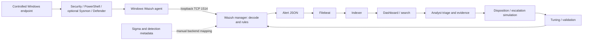

# Optional local Windows / Wazuh lab

This is a reproducible **setup recipe, not a recorded deployment**. No Wazuh
manager, enrolled agent, indexed event, or screenshot was available to validate
the end-to-end path during implementation. Use `python -m detection_lab demo`
for a dependable interview demo. The live acceptance checks below must pass
before describing the optional path as demonstrated.

## Architecture and boundary



The Windows endpoint is the **same machine** as Docker Desktop. Its loopback
ports are intended to reach the Linux containers through Docker Desktop
forwarding, consistent with [Docker Desktop's documented networking model](https://docs.docker.com/desktop/features/networking/).
This particular host path has not been exercised here. A separate
VM or LAN endpoint cannot enroll through this loopback binding. Designing that
network, certificate trust, authenticated enrollment and narrow firewall rules
is separate work; do not replace loopback with a wildcard as a troubleshooting
shortcut. No scanning, attack payloads, credential tests, response automation,
or domain configuration is needed.

## Prerequisites and pinned source

Use a controlled supported Windows lab system, Windows PowerShell 5.1+, Git,
a current patched Docker Desktop release with its WSL2 Linux-container engine,
and Compose **2.24.4 or later**. Require Docker Engine **28.0.0 or later**:
[older engines had a localhost-published-port exposure caveat](https://docs.docker.com/engine/network/port-publishing/).
Allocate
at least 4 CPU cores, 8 GB Docker memory and 50 GB free disk, with additional RAM
for Windows. Check Docker Desktop licensing separately for your use. The resource
floor and Windows/WSL2 architecture follow the [official Docker deployment
guide](https://documentation.wazuh.com/current/deployment-options/docker/wazuh-container.html).

Verified **2026-09-07** against current official documentation: **Wazuh 4.14.7**,
released 2026-07-29. Its [release notes](https://documentation.wazuh.com/current/release-notes/release-4-14-7.html)
and [upstream pin](../lab/wazuh/upstream.json) record the basis for this choice.
Recheck supported releases before a future deployment; upgrades require a new
pin and validation, not automatic replacement with `latest`.

The current [Docker Desktop WSL2 prerequisites](https://docs.docker.com/desktop/features/wsl/)
require WSL 2.1.5 or later. Use Docker Desktop's Linux-container engine from
Windows; a separately installed Docker Engine inside a user WSL distribution
has a different reachability/setup boundary and is not this recipe.

Run in PowerShell from this repository root. These commands do not install
Docker or modify Windows settings:

```powershell
docker version
docker compose version
wsl --status
$repoRoot = (Get-Location).Path
$labRoot = Join-Path $repoRoot '.local\wazuh-docker'
New-Item -ItemType Directory -Path (Join-Path $repoRoot '.local') -Force | Out-Null
git clone --branch v4.14.7 --depth 1 https://github.com/wazuh/wazuh-docker.git $labRoot
if ($LASTEXITCODE -ne 0) { throw 'Clone failed; stop here.' }
$expected = 'adcc5b57d2f7edfcbe6c399272dc76fbdf12b623'
$actual = git -C $labRoot rev-parse HEAD
if ($actual -ne $expected) { throw 'Upstream tag moved or wrong checkout; stop here.' }
git -C $labRoot checkout --detach $expected
Copy-Item -LiteralPath (Join-Path $repoRoot 'lab\wazuh\compose.local.yml') -Destination (Join-Path $labRoot 'single-node\compose.local.yml')
Set-Location (Join-Path $labRoot 'single-node')
$composeArgs = @('-p', 'detection-lab', '-f', 'docker-compose.yml', '-f', 'compose.local.yml')
```

Do not rerun `git clone` over an existing lab. On resume, navigate to the same
`single-node` folder, verify the pin and recreate `$composeArgs`. Preserve the
upstream GPLv2 license in the private clone; this repository supplies an original
overlay rather than redistributing upstream configuration. Image versions are
tag-pinned at 4.14.7; tags are not immutable content digests. Record image IDs and
RepoDigests in private run provenance after pulling to make an actual run
reproducible at the image-content level.

The WSL2 Linux kernel running Docker needs `vm.max_map_count >= 262144`. Inspect
it in the Docker engine's WSL environment, record its current value, and only
then follow the official host prerequisite to set it. This is an intentional
host setting, never changed by repository scripts. On Docker Desktop builds
exposing the `docker-desktop` distribution, the read-only check is
`wsl -d docker-desktop -u root sysctl vm.max_map_count`; an explicit temporary
change is `wsl -d docker-desktop -u root sysctl -w vm.max_map_count=262144`.
If that distribution is unavailable, use Docker Desktop's documented WSL2
configuration for your installed version. Do not assume a user WSL distribution
controls the Docker kernel. Restore the recorded value only after shutting this
lab down and checking no other workload requires it.

## Private credentials and certificates before first startup

Keep the entire clone under ignored `.local/`, outside any cloud-synced folder.
Restrict its Windows directory access to the lab operator and necessary system
administrators. Docker administrators can read container environments and data.
The overlay refuses to render with missing credentials, but it cannot assess
password strength or detect a mismatch with stored password hashes.

1. Use a password manager to create three different random passwords, each at
   least 24 characters. The API password must satisfy Wazuh's 8–64 character,
   uppercase/lowercase/digit/symbol policy. For straightforward `.env` and YAML
   editing, use letters, digits and `!_+=` symbols, avoiding quotes and `$`.
2. Create a private `.env` beside `docker-compose.yml` containing
   `INDEXER_PASSWORD=...`, `DASHBOARD_PASSWORD=...`, and `API_PASSWORD=...`, with
   actual private values replacing the ellipses. Do not paste passwords into
   command history, screenshots, Git or this document.
3. Generate the `admin` and `kibanaserver` bcrypt hashes, one at a time, using
   the interactive official command below. Use the corresponding indexer and
   dashboard-service passwords. Replace their `hash` entries in
   `config/wazuh_indexer/internal_users.yml`. Keep `_meta`, `admin`, and
   `kibanaserver`; remove the unused upstream demo accounts `kibanaro`,
   `logstash`, `readall`, and `snapshotrestore` from this fresh isolated lab.
   Never apply this removal procedure to an existing deployment with real users.
4. Set the `password` in `config/wazuh_dashboard/wazuh.yml` to the **same actual
   API password** as `.env`. This file does not interpolate environment variables.
   The overlay supplies matching API credentials to manager and dashboard.

```powershell
docker run --rm -it wazuh/wazuh-indexer:4.14.7 bash /usr/share/wazuh-indexer/plugins/opensearch-security/tools/hash.sh
docker compose -f generate-indexer-certs.yml run --rm generator
```

The pinned upstream certificate generator uses version 0.0.4 and writes private
keys under `config/wazuh_indexer_ssl_certs`. Generate once for a new lab; preserve
these files across restarts. Inspect certificate subjects, SANs, expiry and CA
fingerprint before trusting the local dashboard. The upstream dashboard
certificate may not match `localhost`; issue a lab certificate with the SAN
you use and the correct container names for internal connections. Use the
official [certificate deployment instructions](https://documentation.wazuh.com/current/deployment-options/docker/wazuh-container.html#certificate-generation).
Do not disable Filebeat certificate verification or globally bypass TLS checks.
If temporarily acknowledging a browser warning on the controlled loopback page,
first verify its fingerprint against your generated certificate and record the
limited trust decision; this is not a production TLS design.

The certificate generator configures the indexer/Filebeat/dashboard trust path.
The manager API has its **own** HTTPS settings and certificate under
`/var/ossec/api/configuration/ssl/`, and enrollment has a separate trust path.
Do not assume the generated indexer CA authenticates either one. The API remains
unpublished on the container network in this recipe; review its certificate
identity/trust before extending that boundary, following [Wazuh API security](https://documentation.wazuh.com/current/user-manual/api/securing-api.html).

For an existing data volume, editing a YAML password hash does **not** update
the initialized indexer's security database. Apply the official
[password rotation procedure](https://documentation.wazuh.com/current/deployment-options/docker/changing-default-password.html),
including its `securityadmin.sh` step, one user at a time. The same source covers
API credential changes and restart requirements. Inventory API users after
startup and rotate/disable unused default accounts through supported management
interfaces. Never retain defaults because ports happen to be local.

## Validate the effective configuration and start

Always pass **both** files; running only the upstream compose publishes extra
ports and uses upstream credentials. The overlay uses Compose `!override` to
replace port lists because [ordinary merge can retain the original bindings](https://docs.docker.com/reference/compose-file/merge/).
It also disables automatic restarts so the lab does not silently return after
a Docker restart.

```powershell
docker compose @composeArgs config --quiet
if ($LASTEXITCODE -ne 0) { throw 'Compose validation failed; do not start.' }
$effective = docker compose @composeArgs config --format json | ConvertFrom-Json
$effective.services.PSObject.Properties | ForEach-Object {
    [pscustomobject]@{ Service = $_.Name; Ports = ($_.Value.ports | ConvertTo-Json -Compress) }
}
```

Only the following host bindings should be present. The rendered configuration
contains secrets; the code above prints **only** names and ports. Never save the
full rendered configuration to evidence or CI logs.

| Host binding | Purpose | Reachability |
|---|---|---|
| `127.0.0.1:1514/tcp` | Agent event transport | Same Windows host only |
| `127.0.0.1:1515/tcp` | Agent enrollment | Same Windows host only |
| `127.0.0.1:8443/tcp` | Dashboard HTTPS | Same Windows host only |
| No host binding for `9200`, `55000`, `514/udp` | Indexer/API/syslog | Container network only as applicable |

```powershell
docker compose @composeArgs pull
docker compose @composeArgs up -d
docker compose @composeArgs ps
docker compose @composeArgs logs --tail 80 wazuh.indexer wazuh.manager wazuh.dashboard
```

Review logs locally; they may contain host information. First boot can take
several minutes. Open [the local dashboard](https://localhost:8443), verify TLS,
and log in as `admin` with the generated indexer password. Check all three
containers, dashboard API connectivity and indexer health. The reviewed compose
has no privileged containers, host networking, added capabilities, or Docker
socket mounts. Upstream images still run powerful services with persistent
writable volumes and elevated memory-lock limits; treat Docker access as
administrative access. Do not attach the host filesystem or Docker socket to
make startup easier.

Use these explicit health checks after startup; the indexer command prompts for
the generated `admin` password without placing it in the command line:

```powershell
docker compose @composeArgs exec wazuh.manager /var/ossec/bin/wazuh-control status
docker compose @composeArgs exec wazuh.indexer curl --fail --cacert /usr/share/wazuh-indexer/config/certs/root-ca.pem --user admin 'https://wazuh.indexer:9200/_cluster/health?pretty=true'
Test-NetConnection -ComputerName 127.0.0.1 -Port 1514 -InformationLevel Quiet
Test-NetConnection -ComputerName 127.0.0.1 -Port 1515 -InformationLevel Quiet
Test-NetConnection -ComputerName 127.0.0.1 -Port 8443 -InformationLevel Quiet
```

An indexer `red` state, unavailable primary shards, connection failure, or failed
TLS check blocks acceptance. A `yellow` state can reflect unassigned replicas
in a one-node lab; inspect the reason and record it rather than labelling it
healthy without explanation. In the dashboard, verify the Wazuh API connection
check succeeds and returns manager version 4.14.7 and an agent list. An indexer
health response alone does not test the manager API. All three loopback tests
must return `True` before proceeding to agent enrollment. If they fail, inspect
Docker Desktop engine mode, container status and local forwarding/firewall
policy. Do not open all interfaces or disable the firewall.

## Windows agent and telemetry

Agent installation requires a deliberate administrator action on the controlled
Windows endpoint. Download `wazuh-agent-4.14.7-1.msi` through the
[official Windows agent guide](https://documentation.wazuh.com/current/installation-guide/wazuh-agent/wazuh-agent-package-windows.html).
Store it outside Git. Check its SHA-256 against published package information
where available and require `Get-AuthenticodeSignature` to return `Valid` with
the expected Wazuh publisher before opening it. A hash you computed alone is
provenance, not publisher authentication.

For the same-host loopback topology, in an elevated PowerShell prompt in the
private installer directory, after signature review:

```powershell
$msiPath = (Resolve-Path -LiteralPath '.\wazuh-agent-4.14.7-1.msi').Path
$signature = Get-AuthenticodeSignature -LiteralPath $msiPath
if ($signature.Status -ne 'Valid') { throw 'Installer signature is not valid.' }
$signature.SignerCertificate.Subject
# Stop and confirm this is the expected Wazuh publisher before installing.
$install = Start-Process -FilePath msiexec.exe -ArgumentList @('/i', ('"{0}"' -f $msiPath), '/qn', '/norestart', 'WAZUH_MANAGER=127.0.0.1', 'WAZUH_REGISTRATION_SERVER=127.0.0.1', 'WAZUH_AGENT_NAME=LAB-WIN01') -Wait -PassThru -WindowStyle Hidden
if ($install.ExitCode -notin @(0, 3010)) { throw "Installer failed: $($install.ExitCode)" }
Start-Service -Name WazuhSvc
Get-Service -Name WazuhSvc
```

Exit code 3010 requests a reboot; arrange it explicitly. This recipe relies on
same-host loopback isolation for initial enrollment; it does not demonstrate
mutually authenticated enterprise provisioning. For any other topology, use
[Wazuh enrollment authentication and manager identity verification](https://documentation.wazuh.com/current/user-manual/agent/agent-enrollment/security-options/index.html)
before opening access.

Back up the existing `C:\Program Files (x86)\ossec-agent\ossec.conf` privately.
Merge the applicable `localfile` blocks from
[agent-ossec-fragment.xml](../lab/wazuh/agent-ossec-fragment.xml) **inside** its
existing `ossec_config`. Preserve the client/enrollment settings and remove
duplicate channel blocks. Security, System and Application are normally already
collected by Wazuh. Use [telemetry.md](telemetry.md) to select the event sources
and intentionally enable any required Windows auditing. Restart `WazuhSvc`
after the reviewed configuration change and check the agent's private
`ossec.log` for channel subscription and connection errors.

From the compose directory, confirm the alias is **Active**, not merely listed:

```powershell
docker compose @composeArgs exec wazuh.manager /var/ossec/bin/agent_control -l
```

Also verify the same agent ID/name/version and a current keepalive in the
dashboard. A running Windows service alone proves neither enrollment nor flow.

## Install rules and prove each boundary

The custom rules are candidates. Read [the field mapping and runtime
limitations](../lab/wazuh/README.md) before installing them. Back up any existing
destination rule file in the manager. Copy this repository's rule file into the
private compose directory, then:

```powershell
Copy-Item -LiteralPath (Join-Path $repoRoot 'lab\wazuh\local_rules.xml') -Destination '.\detection_lab_rules.xml'
docker compose @composeArgs cp .\detection_lab_rules.xml wazuh.manager:/var/ossec/etc/rules/detection_lab_rules.xml
docker compose @composeArgs exec wazuh.manager chown wazuh:wazuh /var/ossec/etc/rules/detection_lab_rules.xml
docker compose @composeArgs exec wazuh.manager chmod 640 /var/ossec/etc/rules/detection_lab_rules.xml
docker compose @composeArgs exec wazuh.manager /var/ossec/bin/wazuh-analysisd -t
docker compose @composeArgs exec wazuh.manager /var/ossec/bin/wazuh-logtest
```

If configuration validation fails, restore the backup and stop. In `logtest`,
paste one genuine serialized Windows event at a time from the manager's
collected input, after sanitization; do not paste a normalized offline fixture
and call that agent-decoder validation. Confirm Phase 2 field names and Phase 3
the expected rule ID. Test a benign negative too. Save the actual input and
result only after sanitization. [Wazuh's rule testing guide](https://documentation.wazuh.com/current/user-manual/ruleset/testing.html)
explains the phases. Reload the live manager only after successful tests:
`docker compose @composeArgs restart wazuh.manager`.

To obtain native input before that first logtest, use the short archive capture
described below and run the benign generator once; retrieve the corresponding
serialized manager input from that private archive. After rule validation and
reload, repeat the generator to test the live alert path. Do not substitute a
made-up manager event when the source channel or agent is unavailable.

From the repository root, run:

```powershell
.\demo\verify-telemetry.ps1
.\demo\generate-safe-events.ps1
.\demo\generate-safe-events.ps1 -Execute
.\demo\verify-telemetry.ps1 -LookbackMinutes 5
```

The one executed payload only prints `DETECTION-LAB-SAFE`. Inspect Sysmon
Event 1 locally in Event Viewer for the exact image, parent, command line,
UTC time and event record ID. Then inspect the dashboard `wazuh-alerts-*` data
view with the same UTC time window and agent filter. Example DQL filters:

```text
agent.name: "LAB-WIN01" AND rule.id: "110001"
agent.name: "LAB-WIN01" AND data.win.system.channel: "Microsoft-Windows-Sysmon/Operational" AND data.win.system.eventID: "1"
agent.name: "LAB-WIN01" AND data.win.system.channel: "Security"
agent.name: "LAB-WIN01" AND data.win.system.channel: "Microsoft-Windows-PowerShell/Operational"
agent.name: "LAB-WIN01" AND data.win.system.channel: "Microsoft-Windows-Windows Defender/Operational"
```

Check actual field types in the data view if quoting or field names differ.
Record the event's source time as well as ingestion/alert time; a stale result
is not proof of the current run. Open the alert's JSON and establish which
fields are present. Triage it as a benign positive if the fixed payload and
operator authorization are confirmed. Do not infer malicious intent from Base64.

**Alerts are not all collected events.** A channel may be flowing with no
event matching an alert rule; Defender may have no selected event at all. To
prove quiet-channel flow, use a short, explicit capture window: enable
`logall_json` in the manager's existing `global` section, enable the Filebeat
Wazuh module's `archives.enabled` setting, restart the manager container and
create `wazuh-archives-*` with time field `timestamp`. The official
[archive indexing procedure](https://documentation.wazuh.com/current/user-manual/manager/event-logging.html#visualizing-the-events-on-the-dashboard)
gives these settings. On Docker, back up the private manager configuration and
the persistent `/etc/filebeat/filebeat.yml` before editing; preserve all other
Filebeat settings. Reuse the channel queries in that data view. This collects
potentially sensitive non-alert events and increases disk usage. After the
window, restore both settings and restart; existing archives remain until
deliberately removed by a reviewed retention/reset procedure. Do not create
malware or disable Defender to manufacture a channel hit.

Acceptance evidence requires all five: local source event; current agent
connection; matching manager receipt/decoder fields; indexed alert/search
result; documented analyst disposition. Use the provenance template in
[evidence/live](../evidence/live/README.md). Until actual files are reviewed and
committed, retain the live-unvalidated label. An XML parser pass is not Wazuh
runtime validation, and a source health summary is not an indexed capture.

## Shutdown, persistence, rollback and reset

From the private `single-node` directory, with the same `$composeArgs`:

```powershell
docker compose @composeArgs stop
# Resume the existing containers:
docker compose @composeArgs start
# Remove this project's containers/network while preserving volumes:
docker compose @composeArgs down
```

Named volumes retain manager configuration, enrolled agent keys, logs/queues,
Filebeat state, index data and dashboard state. Certificates, password hashes,
`.env` and the upstream configuration remain in the private clone. Protect both
the volumes and the bind-mounted files in backups. `down` is not sanitization.

To roll back only the experiment, restore the backed-up custom rules and agent
configuration, run configuration checks, and restart the affected services.
Revert only audit/Sysmon changes you intentionally made, as described in
[telemetry.md](telemetry.md). Remove the agent through Windows Installed Apps
only if this lab installed it. No script unregisters existing agents or clears
Windows event logs.

**Destructive fresh reset, manual only:** first verify `docker compose
@composeArgs ps -a` and `docker volume ls --filter
label=com.docker.compose.project=detection-lab` identify only this lab. Review
and export any evidence you intend to retain. Then `docker compose @composeArgs
down --volumes` deletes this project's named volumes, including indexed events
and enrollment keys. Existing Windows agents need re-enrollment against the
new manager; do not assume old keys remain valid. Private bind-mounted secrets
and certificates survive this command; deliberately rotate them for a fresh
identity. Never use `docker system prune`, broad volume deletion or a script
that resets automatically. Keep the same project name to avoid orphaning data.

## What has and has not been validated

The upstream tag/commit was resolved, current official release/source reviewed,
PowerShell scripts parsed and preview behavior exercised, and XML parsed
offline. An actual Compose 5.5.0 **configuration render** of the pinned upstream
file plus overlay confirmed only the three intended loopback bindings, no
indexer/API/syslog publishing, all three 4.14.7 image tags and `restart: no`.
This check used dummy process-local environment values and did not start
containers. No agent was installed, Windows audit policy changed, Docker daemon
started, event exported, Wazuh logtest executed, or screenshot fabricated during
this implementation. Host/daemon availability and runtime outcomes must be
recorded by the operator when this optional setup is actually run.
